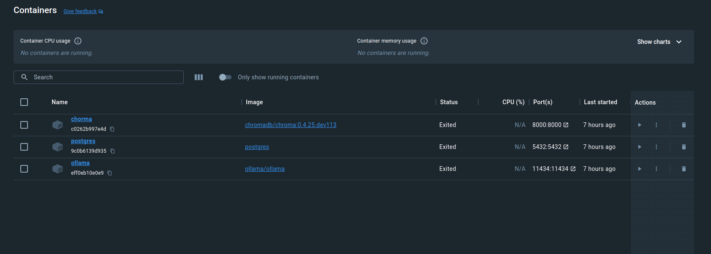

# 🦜️🔗 Chat LangChain
This repo is an implementation of a locally hosted chatbot specifically focused on question answering over the [LangChain documentation](https://python.langchain.com/).
Built with [LangChain](https://github.com/langchain-ai/langchain/), [FastAPI](https://fastapi.tiangolo.com/), [Gadio](https://www.gradio.app/)

## ✅ Set up docker 
 To run locally, I employ [Ollama](https://ollama.com) for LLM inference and embeddings generation. For the vector store I use [Chroma](https://www.trychroma.com/), a free open source vector store. For the record manager, I use a simple PostgreSQL database. And finally, to run Chroma and PostgreSQL you'll need to install Docker.

 ### Ollama

1. Pull and run ollama image (CPU only). Get more infomation [here](https://hub.docker.com/r/ollama/ollama?uuid=adf7abb3-fabc-44c0-b266-93abf707303c%0A)
```shell
docker pull ollama/ollama
docker run -d -v ollama:/root/.ollama -p 11434:11434 --name ollama ollama/ollam
```
1. Download model and embedding model

Download model
```shelll
# mistral model
docker exec -it ollamaollama run mistral
# or you can use llama2 model
docker exec -it ollama ollama run llama2
```

Download embedding model. 
```shell
ollama pull nomic-embed-text
```
### ChromaDB 
```shell
docker pull chromadb/chroma
docker run -p 8000:8000 chromadb/chroma
```

### PostgreSQL
First, pull the PostgreSQL image:
```shell
docker pull postgres
```

Then, run this command to start the image.

```shell
docker run --name postgres -p 5432:5432 -e POSTGRES_PASSWORD=[yourpassword] -d postgres
```
Change "yourpassword" to your desired password. DATABASE_PASSWORD in .env file

For the record manager, you'll also need to create a database inside your PostgreSQL container:

```shell
docker exec -it postgres createdb -U postgres your-db-name
```


### 
## ✅ Running locally
(Recommend using env in conda)

1. Create conda evn
```shell
conda create -n chatbot python==3.10 -y
conda activate chatbot
```
2. Install backend dependence
```shell
pip install poetry
poetry install
```
3. Create .env file (you can copy from .env.example)
```shell
DATABASE_HOST="127.0.0.1"
DATABASE_PORT="5432"
DATABASE_USERNAME="postgres"
DATABASE_PASSWORD="passwordhere"    
DATABASE_NAME="langchainchat"
COLLECTION_NAME="langchainchat"
RECORD_MANAGER_DB_URL = f"postgresql://{DATABASE_USERNAME}:{DATABASE_PASSWORD}@{DATABASE_HOST}:{DATABASE_PORT}/{DATABASE_NAME}"
```
4. Run backend/ingest.py to create vectordb of langchain document
   
   If you want to run by your data, put your data in data folder
5. Run Chat_WithHistory.py file in app
